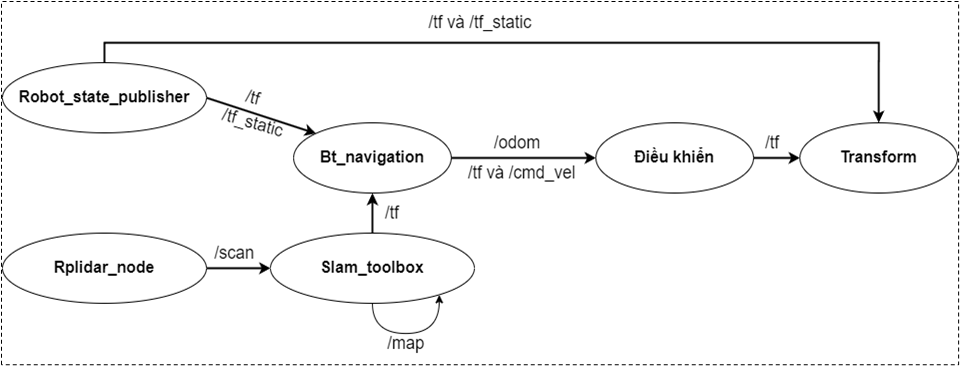
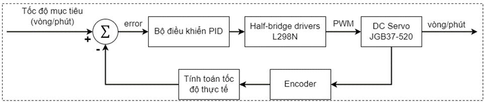
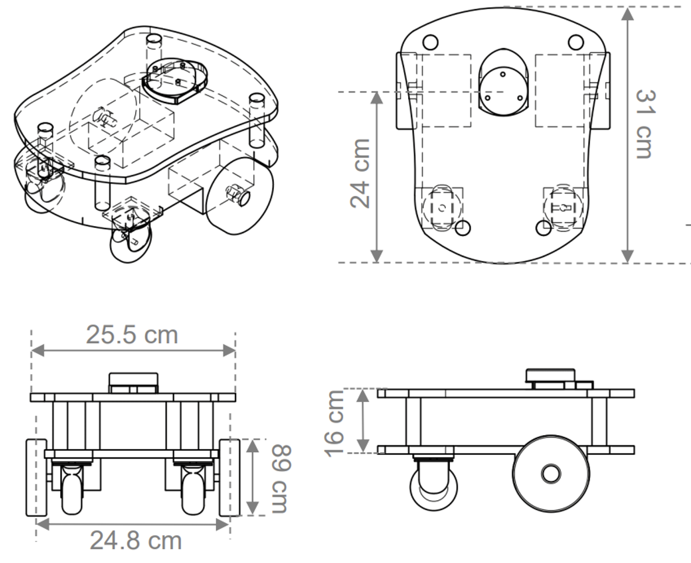

# pumk_bot
Robot hoạt động trên ROS2 platform
Robot sử dụng Raspberry Pi4 Model B làm bộ xử lí trung tâm. 
Arduino, Mạch cầu H, cảm biến Lidar, encoder sensor.
-----------------------------------------------
Chức năng robot:
    + Phát hiện vật cản -> Hình thành quỹ đạo di chuyển, tránh va chạm với các vật cản di chuyển đến đích

Sơ đồ liên kết node trong hệ thống robot:

Sơ đồ khối mô tả thuật toán PID:

Thiết kế robot:

